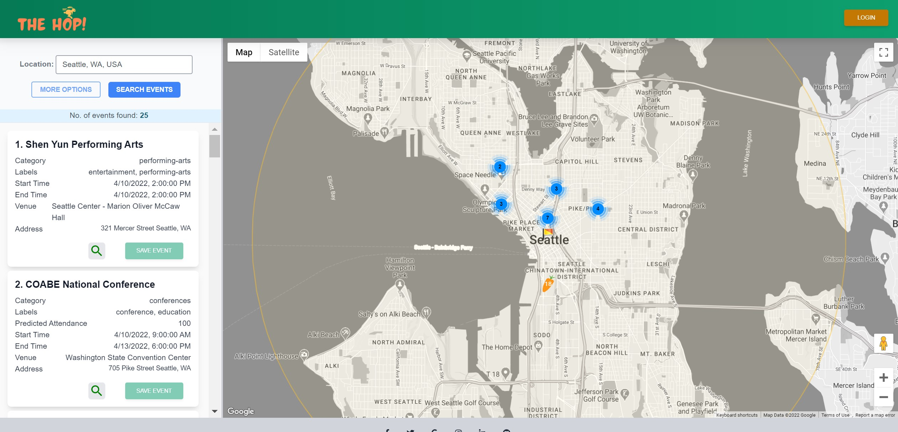
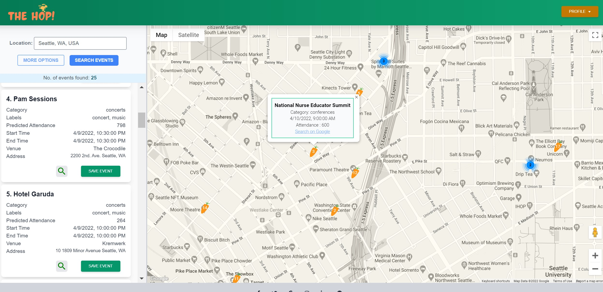
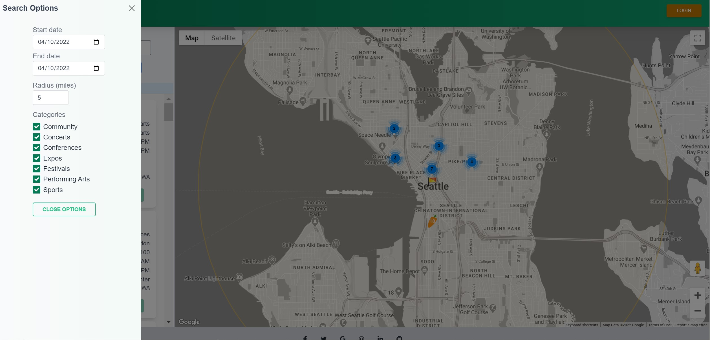
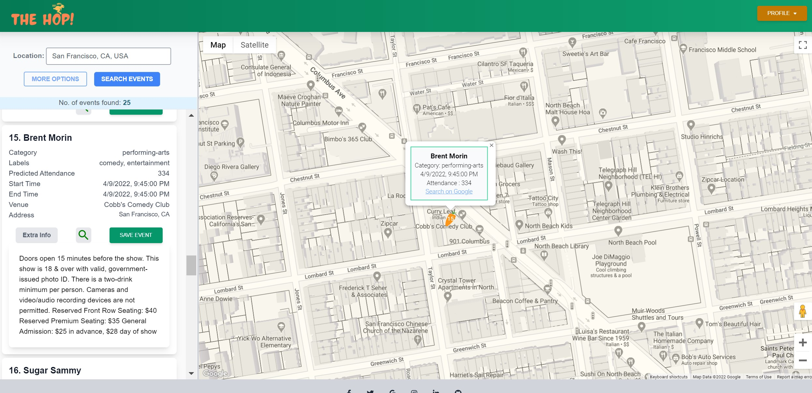
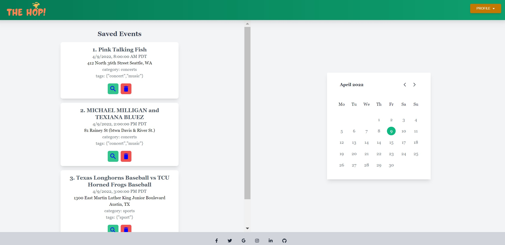
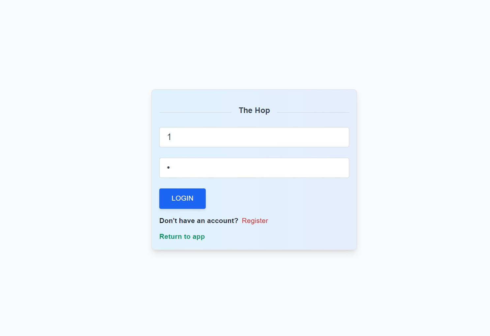

# TheHop!

## Plan something to do right now!

In a hectic society with so much responsibility, spontaneity is all but lost.
If you desire the ability to find events happening NOW, get TheHop.

- Search various events at your current or another selected location
- Filter genres & tastes
- Set a radius from the location
- Create a free account to save events.

## Implementation notes

- Leveraged React and Tailwind CSS for the front end components
- Utilized Node.JS, Express, PostgreSQL on the back end
- Leveraged PredictHQ API, Google Map API, and Google AutoComplete API to search for and display events on a map.

## Community concerts, performing arts festivals, religious observances, sports, & more…right near you…

# TheHop!
